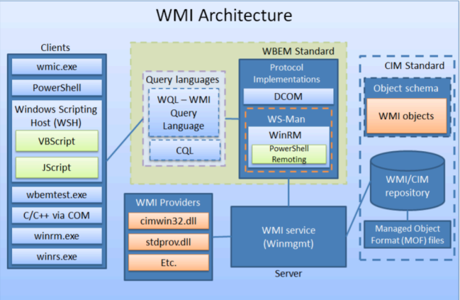
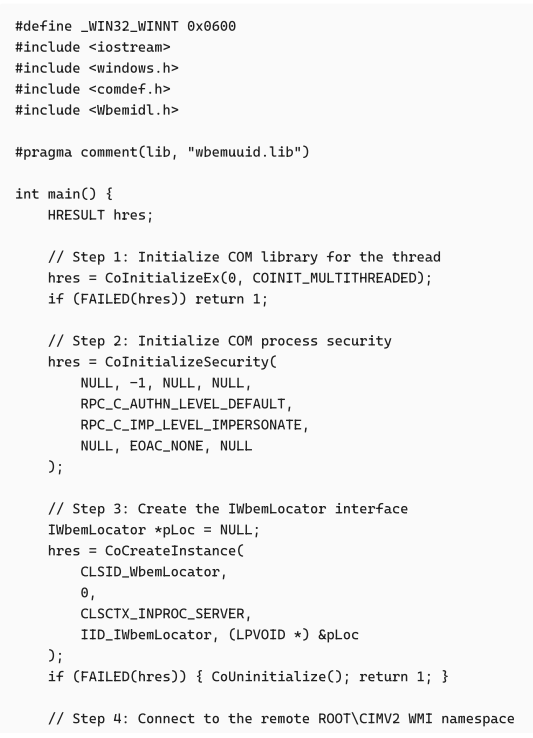
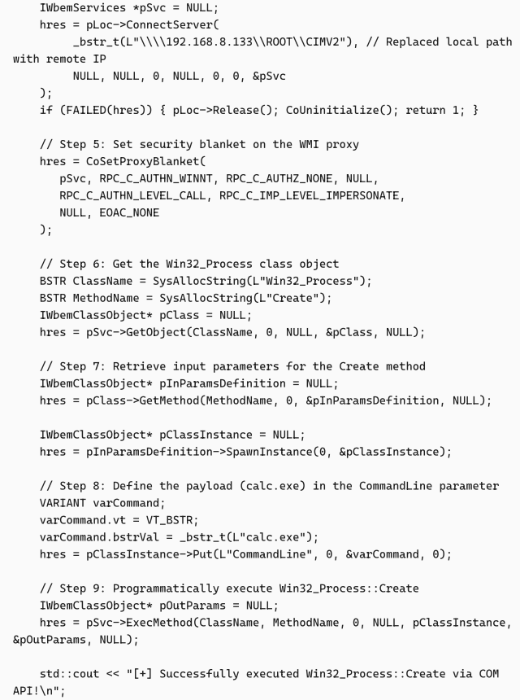
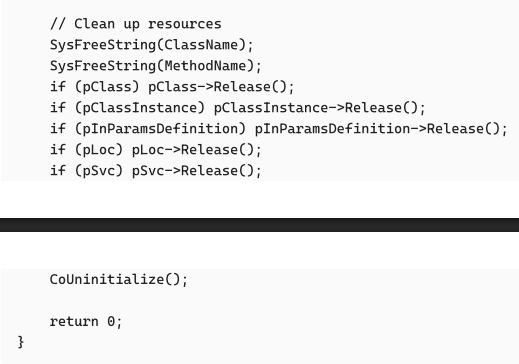

# MITRE ATT&CK Foundation checkpoint

---
<!-- class: default -->

# Kiến thức cơ bản về MITRE ATT&CK

#### ATT&CK framework

* **Motivation:** Được tạo ra để hỗ trợ threat-informed defense và tập trung vào phần đỉnh của Pyramid of Pain (TTPs) thay vì các indicators cơ bản.
* **Purpose:** Được phát triển để ghi nhận, phân tích và ứng phó với các adversary behaviors trong thực tế dựa trên public report.
* **Matrices & Platforms:** Sử dụng các view dạng matrix để trực quan hóa mối quan hệ trong các domain công nghệ cụ thể, bao gồm Enterprise (Windows, macOS, Linux, Cloud), Mobile và ICS.

---
<!-- class: default -->

# Kiến thức cơ bản về MITRE ATT&CK

#### ATT&CK Architecture

* **Tactics (Why), Techniques and Sub-techniques (How):** Phân loại các mục tiêu của adversary và các phương thức cụ thể được sử dụng để đạt được chúng.
* **Procedures:** Cách thức triển khai chính xác một technique của adversary.
* **Tracking Threats:** Liên kết các behaviors với các Threat Groups, Campaigns và Software (Malware/Tools) cụ thể.

---
<!-- class: default -->

# Kiến thức cơ bản về MITRE ATT&CK

#### Defensive countermeasures

* **Mitigations:** Các cấu hình và công cụ được thiết kế để ngăn chặn việc thực thi thành công các techniques.
* **Data Sources & Components:** Xác định các telemetry, sensors và logs cụ thể cần thiết để quan sát các behaviors.
* **Detections:** Các chiến lược phân tích được áp dụng trên dữ liệu thu thập được để nhận diện các techniques.

---
<!-- class: default -->

# Kiến thức cơ bản về MITRE ATT&CK

#### Using ATT&CK

* **Common Language:** Thu hẹp khoảng cách giao tiếp giữa CTI, Red Teams và SOC Analysts để ngăn chặn các thiếu sót trong quá trình vận hành.
* **Adversary Emulation:** Mô phỏng known threats để thiết lập ưu tiên và đánh giá defensive gaps.
* **ATT&CK Navigator:** Được sử dụng để chú thích, chấm điểm và trực quan hóa khả năng bao quát của hệ thống phòng thủ

---
<!-- class: default -->

# T1047 - WMI

#### Introduction

* **What is WMI:** Một công cụ quản trị cốt lõi của Microsoft được tích hợp sẵn trong Windows, cung cấp một interface để thực hiện local/remote system querying, configuration management và monitoring.
* **The LotL Advantage:** Bởi vì đây là một tiện ích thiết yếu, có sẵn và không thể gỡ nó mà không làm hỏng OS, các attackers thường lạm dụng nó cho các hoạt động Living-off-the-Land (LotL) nhằm bypass các signature-based security controls.
* **ATT&CK Mapping (T1047):** Framework này chính thức phân loại hành vi này thuộc Execution tactics.

---
<!-- class: default -->

# T1047 - WMI

#### WMI & CIM Definitions

* **WMI:** Bản triển khai của Microsoft đối với Web-Based Enterprise Management (WBEM). Nó cung cấp một giao diện có sẵn cho việc local và remote system querying, configuration và monitoring.
* **CIM (Common Information Model):** Một tiêu chuẩn open-source định nghĩa một object-oriented schema không đặc trưng cho bất cứ nhà cung cấp nào để đại diện cho các hardware, software và network components.
* **The Relationship:** CIM thiết lập standard cho conceptual framework và baseline schema, trong khi WMI đóng vai trò là execution engine để triển khai standard này dành riêng cho Windows.

---
<!-- class: default -->

# T1047 - WMI

#### WMI Infrastructure & Components

* **WMI Service (winmgmt):** Core routing và processing broker chạy liên tục trong nền để bắt và chuyển các queries.
* **WMI Repository (OBJECTS.DATA):** Central binary database lưu trữ các định nghĩa, namespaces, và persistent object instances của CIM class tĩnh.
* **WMI Providers:** Các Component Object Model (COM) DLLs đảm nhiệm việc querying OS theo thời gian thực để populate data cho các namespaces như root\cimv2.

---
<!-- class: default -->

---
<!-- class: default -->

# T1047 - WMI

#### Transport protocol

| Protocol | Mechanism | Ports | Offensive Context |
|---|---|---|---|
| **DCOM/RPC** | Legacy WMI transport | TCP 135 (Mapper) & 49152–65535 (Ephemeral) | Blocked by strict firewalls restricting dynamic port ranges. |
| **WinRM** | Modern WS-Man (SOAP/XML) | TCP 5985 (HTTP) & 5986 (HTTPS) | Highly firewall-friendly; heavily abused for lateral movement. |

---
<!-- class: default -->

# T1047 - WMI

#### Local Process Spawning

* **Using wmic.exe:** Tận dụng cmd line console được cài đặt sẵn (ví dụ câu lệnh: wmic.exe process call create) để proxy việc execution của các binaries.
* **Using PowerShell:** Sử dụng các built-in cmdlets như Invoke-WmiMethod hoặc phiên bản hiện đại hóa Invoke-CimMethod để gọi class Win32_Process.
* **Advantage:** Cả hai phương pháp đều hoạt động như các Living-off-the-Land (LotL) proxies giúp che giấu process lineage. Payload được spawn dưới dạng một child process của WMI Provider Host (WmiPrvSE.exe) thay vì shell, qua đó bypass các cơ chế giám sát tiến trình cha con tiêu chuẩn.

---
<!-- class: default -->

# T1047 - WMI

#### Remote Execution & Lateral Movement

| Feature | Remote WMI via DCOM | Remote WMI over WinRM |
|---|---|---|
| **Protocol** | DCOM (DCE/RPC) | WS-Man (HTTP/HTTPS) |
| **Tools** | Impacket's `wmiexec.py` | PowerShell (`New-CimSession`, `Invoke-CimMethod`) |
| **Mechanics** | Interacts with the remote `ISystemActivator` interface | Utilizes modern CIM standard cmdlets |
| **Output Handling** | Wraps payload in `cmd.exe`, redirects output to `ADMIN$` share, and reads via SMB | Executed dynamically without requiring SMB redirection |

---
<!-- class: default -->

# T1047 - WMI

#### System Discovery & Reconnaissance

* **WQL Execution:** Attackers use cmdlets như `Get-WmiObject` để thực thi các câu lệnh WMI Query Language (WQL), nhằm enumerate hệ thống và blending in with standard administrative traffic.
* **Some Query Providers:**
  * **Core System (`root\cimv2`):** Extract các hardware info và tiến trình đang hoạt động bằng cách querying các classes như `Win32_Process`.
  * **Security Mapping (`root\SecurityCenter2`):** Trực tiếp query `AntiVirusProduct` để phát hiện các EDR hoặc sản phẩm AV đã được cài đặt.
  * **Active Directory (`root\directory\ldap`):** Extract thông tin về domain users, computers, và group configurations.

---
<!-- class: default -->

# T1047 - WMI

#### Programmatic / Unmanaged Execution

* **Direct API Interaction:** Bypass các standard command-line interpreters (wmic.exe, PowerShell) bằng cách tương tác trực tiếp với các WMI Component Object Model (COM) APIs thông qua unmanaged code (C++ hoặc .NET).
* **Mechanics:** Malware khởi tạo `IWbemLocator` để kết nối đến `root\cimv2`, sau đó sử dụng `IWbemServices::ExecMethod` để invoke `Win32_Process::Create`.
* **Advantage:** Spawn các payloads hoàn toàn trên bộ nhớ. Bởi vì không có bất kỳ command-line wrapper nào được sử dụng, technique này hoàn toàn bypass Process Creation logging (Event ID 4688).

---
<!-- class: default -->
<!-- _header: "" -->

  
  
  

Sample code interacting with WMI COM API

---
<!-- class: default -->

# T1047 - WMI

#### WmiPrvSE.exe & Defense Evasion

* **Parent-Child Relationship:** Các payload sử dụng WMI phá vỡ execution chain thông thường bằng cách spawn dưới WMI Provider Host (WmiPrvSE.exe) thay vì initiating process, qua đó che giấu process lineage và evade các standard security analytics.
* **Security Product Manipulation:** Bởi vì attackers có thể execute code mà không cần phần mềm thứ 3, họ lạm dụng WMI để ngầm gỡ cài đặt các EDR/AV solutions thông qua class Win32_Product mà không trigger uninstall logs.
* **Event Log Tampering:** Các adversaries thường xuyên target vào class Win32_NTEventlogFile và invoke method ClearEventLog để xóa critical forensic logs trực tiếp thông qua WMI infrastructure.

---
<!-- class: default -->

# T1047 - WMI

#### Standard WMI Logging

| Log Source | Event ID | Description |
|---|---|---|
| **Windows Security** | `Event ID 4688` | Process Creation (identifies `WmiPrvSE.exe` spawning child processes). |
| **Windows Security** | `Event ID 4624` | Logon Type 3 (Network logon during remote WMI execution). |
| **Sysmon** | `Event ID 1` | Process Creation (captures command-line arguments and parent-child lineage). |
| **Sysmon** | `Event ID 19, 20, 21` | WMI Activity (WmiEventFilter, WmiEventConsumer, and Filter-to-Consumer Binding). |

---
<!-- class: default -->

# T1047 - WMI

#### ETW Telemetry

* **ETW Provider:** The Microsoft-Windows-WMI-Activity provider cung cấp nhiều thông tin chi tiết hơn về native WMI execution mà log thông thường không bắt được.

| Channel | Event ID | Telemetry Description |
|---|---|---|
| **Operational** | `5857` | Provider initialization and host startup events. |
| **Operational** | `5858` | Query and method execution errors (flags malformed or failed reconnaissance). |
| **Operational** | `5859, 5860, 5861` | WMI Event Filter, Consumer, and Binding activity (identifies persistence). |
| **Trace** | `11` | Method invocation (captures `Win32_Process::Create`, caller PID, and user context). |

---
<!-- class: default -->

# T1047 - WMI

#### Blinding ETW (Defense Evasion)

* **The Telemetry Problem:** Bởi vì ETW cung cấp thông tin chi tiết vào quá trình thực thi các program qua WMI, các attackers tích cực nhắm vào nó để tránh bị phát hiện.
* **Evasion Techniques:**
  * **In-Memory Patching:** Malware locate `ntdll!EtwEventWrite` bên trong memory space của `WmiPrvSE.exe` và ghi đè vài bytes đầu tiên bằng một RET (return) instruction, qua đó lặng lẽ drop nguồn data.
  * **Provider Disabling:** Attackers lạm dụng quyền admin để tắt hoàn toàn logging channel bằng cách sử dụng các công cụ có sẵn (ví dụ: `wevtutil sl Microsoft-Windows-WMI-Activity/Operational /e:false`).

  
---
<!-- class: default -->

# T1047 - WMI

#### Simulation - Cinnamon Tempest

* **Threat Context:** Cinnamon Tempest tận dụng các công cụ LotL cho quá trình lateral movement nhằm ẩn mình vào các hành động legit của admin.
* **Techniques:** Sử dụng `wmiexec.py` của Impacket để thiết lập một kết nối DCOM/RPC ban đầu qua TCP port 135 nhằm trigger WMI execution.
* **Mechanics:** Quá trình WMI process creation của Windows sẽ không có output và không có return stream; attacker bắt buộc phải wrap execution vào `cmd.exe` và điều hướng `stdout` / `stderr` thông qua SMB để giả lập một phiên semi-interactive.

---
<!-- class: default -->

# T1047 - WMI

#### Simulation - Cinnamon Tempest

* **Command-Line Telemetry:** Các process creation logs (Sysmon Event ID 1 / Security Event ID 4688) cho thấy `WmiPrvSE.exe` spawning `cmd.exe` chứa redirection string đặc trưng (`\\127.0.0.1\ADMIN$\__<timestamp>`).
* **Disk & Share Artifacts:** Các ephemeral files `__<timestamp>` được ghi vào `C:\Windows\` thông qua `ADMIN$` share; những sessions chưa kết thúc hoặc bị ngắt đột ngột sẽ để lại các file text trên ổ đĩa.
* **Telemetry Correlation:** Dấu vết đáng tin cậy phụ thuộc vào việc correlating DCOM network connection (TCP 135), quá trình child process creation của `WmiPrvSE.exe`, và truy cập file SMB share ngay sau đó (Security Event ID 5145) bên trong một khoảng thời gian ngắn.

---
<!-- class: default -->

# T1047 - WMI

| Execution Phase | Log Source | Event ID | Telemetry Details |
|---|---|---|---|
| **Authentication** | Windows Security | `4624` | Logon Type 3 (Network logon) via NTLM or Kerberos over RPC/SMB. |
| **Method Invocation** | WMI-Activity (Trace) | `11` | Method invocation capturing `Win32_Process::Create` and the caller context. |
| **Process Spawning** | Sysmon / Security | `1` / `4688` | `WmiPrvSE.exe` spawning `cmd.exe` containing redirection to `\\127.0.0.1\ADMIN$\__<timestamp>`. |
| **Share Interaction** | Windows Security | `5140` / `5145` | Share access and detailed object checking on `ADMIN$` and `IPC$`. |
| **File Creation & Cleanup** | Sysmon | `11` / `23` | Creation of `C:\Windows\__<timestamp>` on disk, followed by deletion upon output retrieval. |

---
<!-- class: default -->

# T1047 - WMI

#### Mitigation

* **Access Control & Namespace Security:** Loại bỏ các tài khoản local administrator không cần thiết và hạn chế người dùng thuộc group Distributed COM Users. Hạn chế các quyền Remote Launch/Activation thông qua `dcomcnfg.exe`, và thu hồi quyền Remote Enable trên các critical namespaces như `root\cimv2` bằng cách sử dụng `wmimgmt.msc`.
* **WMIC Phased Deprecation:** Dịch chuyển các workflows sang các modern CIM/PowerShell cmdlets và loại bỏ `wmic.exe` qua ba giai đoạn: Audit (WDAC/AppLocker + Sysmon Event 1 / Security Event 4688), Enforce (execution blocking), và Removal (uninstalling optional feature).
* **DCOM Protocol Hardening (CVE-2021-26414):** Đảm bảo deploy các bản vá nhằm enforce bắt buộc `RPC_C_AUTHN_LEVEL_PKT_INTEGRITY` để ngăn chặn các RPC activation bypasses và relay attacks. Audit các client Event IDs 10037 và 10038 để phát hiện các legacy software không tương thích.
* **Network Microsegmentation:** Triển khai các host firewalls và ACLs để chặn workstation-to-workstation lateral movement. Hạn chế inbound traffic trên TCP 135 (RPC/DCOM) và TCP 5985/5986 (WinRM) chỉ cho phép từ các jump-hosts được chấp thuận, central management servers, và administrative subnets.

---
<!-- class: default -->

# T1021.002 - SMB admin share

#### Overview

* **MITRE ATT&CK Classification:** Được phân loại thuộc nhóm Lateral Movement (TA0008), định nghĩa cách các adversaries sử dụng tài khoản hợp lệ để tương tác với các remote network shares thông qua SMB.
* **Transport & Networking:** Hoạt động qua TCP Port 445, đóng vai trò quan trọng cho các việc chuyển file hợp lệ và encapsulated protocol traffic.
* **Dual Operational Role:**
  * **Payload & Staging:** Hỗ trợ việc ghi các malicious binaries xuống disk và thu thập các command execution outputs thông qua các hidden shares.
  * **RPC tunnel:** Đóng vai trò là transport layer để tunnel Distributed Computing Environment / Remote Procedure Calls (DCE/RPC) giữa các endpoints.
* **Execution Prerequisites:**
  * **Elevated Credentials (T1078):** Yêu cầu quyền local administrator, do các standard user accounts bị block hoàn toàn khỏi các default administrative shares.
  * **Network Reachability:** Yêu cầu unfiltered host-to-host connectivity qua TCP port 445 với SMB service đang active trên target.

---
<!-- class: default -->

| Share Name | Mapped Path / Nature | Access Requirement | Primary Adversary Use Case |
|---|---|---|---|
| **ADMIN\$** | `C:\Windows` (System Root) | Local Administrator | Staging malicious payloads and executables prior to invoking remote execution. |
| **C\$** | `C:\` (Volume Root) | Local Administrator | Reading/writing temporary batch scripts and capturing redirected command output (e.g., `__output`). |
| **IPC$** | Inter-Process Communication (Virtual conduit, no disk path) | Authenticated Users / Admins | Authenticating against the target to access named pipes, which then serve as the underlying transport for RPC interactions. |

Admin shares

---
<!-- class: default -->

# T1021.002 - SMB admin share

#### RPC over Named Pipes

* **The Conceptual Gateway:** Khác với các administrative shares khác, `IPC$` share không map với một file/thư mục nào trên ổ đĩa. Nó hoạt động hoàn toàn như một giao diện cho IPC giữa các clients, servers và services trên các network endpoints.
* **The Transport Layer:** Bằng cách thiết lập một kết nối xác thực đến `IPC$` qua SMB, attackers có access vào các named pipes, đóng vai trò là underlying transport mechanism cho Remote Procedure Calls (RPC).
* **Fileless Advantage:** Việc layering RPC trên các SMB named pipes cho phép kẻ xấu invoke các remote system APIs và thực thi functions trên target machine mà không cần dùng tool ngoài, bypass yêu cầu phải drop các physical executables xuống disk trước.

---
<!-- class: default -->

# T1021.002 - SMB admin share

#### Targeting System Services

Một khi kênh liên lạc được thiết lập thông qua `IPC$`, attackers tiến hành bind vào các named pipes cụ thể nhằm biến các legitimate network protocols thành các robust channels phục vụ cho remote administration và command execution.

| Named Pipe | Target Service | Offensive Use Case & Mechanics |
|---|---|---|
| `\pipe\svcctl` | Service Control Manager | Allows attackers to remotely create, start, or modify services. This is the core mechanic driving execution tools like `PsExec` and `smbexec`. |
| `\pipe\atsvc` | Task Scheduler | Interacts with the remote Task Scheduler to silently register and execute tasks, commonly abused by tools like `atexec`. |
| `\pipe\epmapper` | RPC Endpoint Mapper | Utilized for deep reconnaissance to enumerate exposed RPC services and map them to their corresponding listening ports. |

---
<!-- class: default -->

# T1021.002 - SMB admin share

#### Authentication Exploitation - Pass-the-Hash (PtH)

* **Core Mechanics:** Pass-the-Hash cho phép các attackers authenticate vào các remote SMB services bằng cách inject NTLM hash bắt được trực tiếp vào authentication protocol, qua đó bypass các standard interactive logon requirements mà không cần đến tài khoản và mật khẩu.
* **Execution Prerequisite:** Để sử dụng thành công technique này thông qua T1021.002, injected hash phải thuộc về một account có quyền admin local, do các tài khoản của người dùng bình thường không thể authenticate vào các hidden administrative shares như `ADMIN$` hoặc `C$`.

---
<!-- class: default -->

# T1021.002 - SMB admin share

#### Authentication Exploitation - NTLM Downgrade

* **Strategic Objective:** Được chain với `PtH` trong các hệ thống có legacy settings enabled nhằm buộc targets phải đàm phán các protocol có security levels yếu hơn hoặc cryptographically flawed.
* **Attack Progression:**
  * **Authentication Coercion:** buộc target authenticate tới đến một attacker-controlled listener.
  * **Negotiation Tampering:** Tắt Extended Session Security (ESS) trong quá trình negotiation để buộc sử dụng chuẩn `NTLMv1`.
  * **Challenge Control:** gửi một static challenge để capture vulnerable `NTLMv1-SSP` response.
  * **Hash Recovery:** Tìm được `NT hash` ban đầu một cách nhanh chóng bằng cách sử dụng bảng cầu vồng được tính toán sẵn.
* **Execution Outcome:** `NT hash` được recover sẽ được feed trực tiếp vào SMB tooling để có thể `RCE` mà không cần có plaintext password.

---
<!-- class: default -->

# T1021.002 - SMB admin share

#### Execution - PsExec (SCM Abuse)

* **Payload Staging:** authenticate qua SMB và drop một executable payload trực tiếp vào một admin share (VD: `ADMIN$`).
* **RPC connection:** Thiết lập một kết nối RPC đến Service Control Manager (SCM) bằng cách bind vào named pipe `\pipe\svcctl`.
* **Service Creation & Execution:** Sử dụng SCM RPC calls để tạo một Windows service trỏ đến payload, chạy payload với quyền SYSTEM.
* **Interactive I/O & Cleanup:** Tạo một named pipe thứ 2 để wrap các standard input, output, và error streams cho một interactive shell. Khi hoàn thành, công cụ sẽ dừng service, xóa đăng ký service, và xóa payload khỏi disk.

---
<!-- class: default -->

# T1021.002 - SMB admin share

#### Execution - SMBExec (Command string execution)

* **Service Creation (No Binary Drop):** Authenticate qua SMB và tương tác với SCM thông qua `\pipe\svcctl` để tạo một service có execution path hoàn toàn dựa vào native `%COMSPEC%` environment variable (resolve thành `cmd.exe`).
* **Batch File Staging:** Command của attacker được thực thi bởi `cmd.exe`, process này sẽ ghi các instructions trực tiếp vào một batch file tạm thời (`.bat`) được lưu trên admin share, vd như `C$`.
* **Output Redirection:** Batch file tạm thời sẽ execute payload, đồng thời redirect các standard output và standard error streams vào một file text tạm thời (ví dụ như `__output`), cũng được đặt trên `C$` share.
* **Retrieval & Cleanup:** Retrieve results bằng cách đọc output file trực tiếp thông qua SMB connection, ngay lập tức sau đó tiến hành xóa service, batch files và output files để xóa dấu vết.

---
<!-- class: default -->

# T1021.002 - SMB admin share

#### Execution - `atexec` (Task Scheduler)

* **SCM Evasion:** Bypass SCM để tránh generate Service Creation logs.
* **RPC:** Authenticate qua SMB và sử dụng Task Scheduler RPC interface thông qua `\pipe\atsvc` named pipe.
* **Task Execution:** Viết execution instruction vào 1 batch file tạm thời, rồi tạo một scheduled task được cấu hình để chạy batch file đó ngay lập tức qua `cmd.exe`.
* **Output & Cleanup:** Redirect command output vào một file tạm thời (thường nằm ở `C:\Windows\Temp`), lấy kết quả qua `ADMIN$` hoặc `C$` share thông qua SMB, và delete cả task lẫn files nhằm loại bỏ các forensic artifacts.

---
<!-- class: default -->

# T1021.002 - SMB admin share

#### Execution - WMI

* **No named pipes:** Sử dụng DCOM qua TCP port 135 để tương tác với WMI, không sử dụng named pipes.
* **Process creation:** Invoke class `Win32_Process` để spawn một command shell dưới dạng một child process của WMI Provider Host (`wmiprvse.exe`).
* **Output Redirection:** Redirect command output vào một file nằm trực tiếp trên `ADMIN$` share.
* **SMB Retrieval:** Retrieve execution results bằng cách đọc file này thông qua một kết nối SMB trước khi clean up các artifacts.

---
<!-- class: default -->

| Tool / Framework | Primary Mechanism | Payload Staging | Execution Trigger | Key Forensic Artifacts |
|---|---|---|---|---|
| **PsExec** | Service Control Manager via `\pipe\svcctl` | Drops a physical executable binary to a share (e.g., `ADMIN$`). | Dynamic Windows Service. | Physical binary on disk; Service Creation logs (Event ID 7045) showing the executable path. |
| **smbexec** | Service Control Manager via `\pipe\svcctl` | Native `%COMSPEC%` writes commands to a temporary `.bat` file (e.g., `C$`). | Windows Service executing a command string. | Ephemeral `.bat` and output files; Service Creation logs (Event ID 7045) revealing the full command string. |
| **atexec** | Task Scheduler via `\pipe\atsvc` | Writes execution instructions to a temporary `.bat` file. | Ephemeral Scheduled Task. | Scheduled task logs; temporary `.bat` and output files (e.g., in `C:\Windows\Temp`) |
| **wmiexec** | WMI/DCOM via TCP port 135 | Direct command execution string. | `Win32_Process` class instantiation. | `wmiprvse.exe` spawning `cmd.exe`; temporary output text file on `ADMIN$` |

---
<!-- class: default -->

# T1021.002 - SMB admin share

#### P2P C2 Architecture

Các attackers kết nối các endpoint nội bộ với nhau thông qua SMB named pipes (`TCP port 445`) để proxy C2 traffic, tránh việc tất cả endpoint cùng connect với một host ngoài network và blend vào admin traffic.

| Architecture Model | Connection Mechanics | Detection Considerations |
|---|---|---|
| **Traditional Hub-and-Spoke** | Each compromised endpoint maintains an independent external connection. | Generates multiple outbound connections easily flagged by network perimeter analysis. |
| **Agent-to-Agent (P2P)** | Compromised hosts proxy commands internally through a designated gateway. | Drastically reduces network footprint by utilizing a single external egress point. |

---
<!-- class: default -->

# T1021.002 - SMB admin share

#### P2P C2 applications

* **Internal SMB Beacons:** Các offensive tool (ví dụ: `Cobalt Strike`) khởi tạo các listening named pipes trên các secondary endpoints thay vì listening trên các network sockets.
* **Pipe Masquerading:** Attackers ngụy trang các malicious named pipes bằng cách đổi tên thành các pipes thông thường (chẳng hạn như browser crash reporting pipes) để blend vào system noise.
* **Gateway Relay:** Gateway agent kết nối đến các internal named pipes thông qua SMB, forward commands và exfiltrate data trở lại thông qua một C2 channel duy nhất, nhằm tránh sự chú ý khi có quá nhiều endpoint connect ra mạng internet.

---
<!-- class: default -->

# T1021.002 - SMB admin share

#### Telemetry

* **Heuristic Analysis:** So sánh network flow data (ví dụ: `conn.log` của Zeek) với baseline để flag các workstations kết nối đến một số lượng peers bất thường qua TCP port 445.
* **Deep Packet Inspection (Protocol Analysis):** Parse SMB traffic thông qua PCAP hoặc các network security monitors (ví dụ: `smb_files.log` và `dce_rpc.log` của Zeek) để extract các named pipes cụ thể được access qua `IPC$` share. Điều này cho phép phân biệt các custom P2P proxy pipes với normal pipes usage, chẳng hạn như `\pipe\spoolss` hoặc `\pipe\netlogon`.

---
<!-- class: default -->

| Event Source | Telemetry Focus | Detection Logic & Indicators |
|---|---|---|
| **Security Event 4624** (Logon) | Network Logons (Type 3) via NTLM / NTLMv2. | Rapid, sequential Type 3 events across multiple target machines from an unexpected workstation source serve as high-fidelity indicators of credential reuse and lateral movement. |
| **Security Event 5140 / 5145** (Share Access) | Target `ShareName` (`ADMIN$`, `C$`, `IPC$`). | Flag non-administrative workstations accessing default admin shares for binary staging or accessing `IPC$` to establish named pipe connections. |
| **System Event 7045** (Service Creation) | `SVCCTL` RPC interactions; `ServiceName` and `ImagePath` fields. | Detects lateral movement execution tools; exposes physical payload paths (e.g., PsExec) or embedded execution command strings directly within the `ImagePath` (e.g., smbexec). |
| **Sysmon Event 1** (Process Creation) | Process lineage (parent-child trees) running as `NT AUTHORITY\SYSTEM`. | Monitor native system core processes (`services.exe`, `WmiPrvSE.exe`) unexpectedly spawning command-line interpreters (`cmd.exe`, `powershell.exe`) to execute remote payloads. |

---
<!-- class: default -->

#### Simulation
| Threat Actor|  Mechanics | Key Telemetry & Artifacts |
|---|---|---|
| **BlackEnergy** (`psexec`) | Drops payload to `ADMIN$`. Executes via `cmd.exe /c certutil` (hosted via HTTP) to bypass the 5-minute SCM timeout limit. | **Evt 5140/5145:** Access to `ADMIN$` and `IPC$` (`\pipe\svcctl`).  **Evt 7045:** Creation of a dynamic, randomized alphanumeric service. |
| **FIN8** (`smbexec`) | Establishes a semi-interactive shell using native `%COMSPEC%` and temporary batch scripts without dropping a compiled binary. | **Evt 7045:** `%COMSPEC%` command string exposed directly in `ImagePath`.  **Sysmon 1:** `cmd.exe` executing echo commands.  **Evt 5145:** `C$` share access for `__output` file. |
| **APT41** (`wmiexec`) | Two-stage staging: Transfers payload to `C:\Windows` via SMB, then triggers execution via DCOM/WMI. | **Sysmon 1:** `WmiPrvSE.exe` spawns `cmd.exe`, redirecting output to `127.0.0.1\ADMIN$`.  **Evt 5145:** `ADMIN$` share access to read the temporary output file. |

---
<!-- class: default -->

# T1021.002 - SMB admin share

#### Mitigation

* **Local Administrator Password Solution (LAPS):** Khởi tạo ngẫu nhiên và quản lý tập trung mật khẩu admin trên toàn domain. Điều này đảm bảo rằng việc local admin NTLM hash trên một máy trạm không thể sử dụng để authenticate vào một máy trạm khác.
* **Segmentation:** Sử dụng host-based firewall để block TCP port 445 traffic cho các workstations không sử dụng SMB communication.
* **Principle of Least Privilege:** Audit và restrict các local admin group memberships. Nếu không có quyền admin, các accounts bình thường không thể access vào các admin shares (`ADMIN$`, `C$`) hoặc bind vào các RPC endpoints như `\pipe\svcctl`.

---
<!-- class: default -->

# CTI Training

#### The CTI Mapping Process

* Tìm hành vi
* Nghiên cứu hành vi
* Map hành vi thành tactics
* Nhận diện techniques và sub-techniques
* So sánh kết quả với các analysts khác

---
<!-- class: default -->

# CTI Training

#### Find & Research Behaviors

* **Finding in Narrative Reporting:** Tìm các động từ chỉ hành động (ví dụ: "installed," "created scheduled task") mô tả các bước thực hiện, đồng thời loại bỏ các indicators không phải hành động như file hashes hoặc infrastructure IP addresses.
* **Finding in Raw Data:** Nhận diện các behaviors trực tiếp từ các technical artifacts, chẳng hạn như command execution được capture thông qua Sysmon, sự thay đổi registry key, hoặc network flow bất thường.
* **Contextual Research:** Đọc và nghiên cứu thêm các hành vi đã phát hiện để hiểu rõ cách chúng hoạt động của chúng. Điều này đòi hỏi quá trình phân tích protocol có liên quan (ví dụ: SMB hoặc SOCKS routing) và áp dụng kiến thức chuyên môn để xâu chuỗi các raw artifacts lại với nhau.

---
<!-- class: default -->

# CTI Training

#### Translate to Tactic & Identify Techniques

* **Translate to Tactic (Intent):** Đánh giá hành vi để xác định mục tiêu của attackers. Mặc dù các reports thường ghi mục tiêu này, quá trình phân tích dữ liệu thô đòi hỏi domain expertise để map các isolated artifacts thành các tactics.
* **Identify Techniques (Methods):** Phân tích từ tactic đã được xác định xuống đến technique chính xác, luôn luôn mapping xuống sub-techniques khi có đầy đủ thông tin.
* **Mapping Strategies:** Tận dụng tìm kiếm từ khóa trên ATT&CK matrix, phân tích ví dụ về các procedure trên các group/software pages, và review các định nghĩa technique bên trong tactic.
* **Concurrent Techniques:** Nhận thức rằng một procedure thường map với nhiều techniques trùng nhau để xác định chính xác hành động và cách thực hiện chúng.

---
<!-- class: default -->

# CTI Training

#### Hedge Biases

* **Consumer Biases:** Cần đề phòng Novelty Bias (tập trung chủ yếu vào các mối đe dọa mới nổi, hấp dẫn) và Availability Bias (dựa vào các techniques dễ nhớ thay vì search trên toàn bộ matrix).
* **Source & Visibility Biases:** Nhận thức rằng raw intelligence thường bị skewed nặng nề về phía vendor reporting và các giải pháp cụ thể mà org đã deploy, tạo ra các điểm mù.
* **Mitigation Strategies:**
  * **Collaborate:** So sánh các mappings với các analysts khác để cover các nhiều technical domains và chủ động loại trừ bias cá nhân.
  * **Diversify & Calibrate:** Thêm nhiều data source và điều chỉnh nơi có lỗ hổng thông tin.
  * **Prioritize the Known:** Tập trung vào việc track các attacker đã biết thay vì cố gắng thực hiện các so sánh hoặc đuổi theo những điều bất thường.

  
---
<!-- class: default -->

# CTI Training

#### Making defensive recommendation

* **Step 0: Prioritize Techniques:** Lọc ATT&CK matrix thành một nhóm những kỹ thuật bằng cách xác định những kỹ thuật hay được lặp lại bởi các attackers và review các gaps hiện có.
* **Step 1 & 2: Research Defensive Options:** Tham khảo ATT&CK knowledge base, Cyber Analytics Repository (CAR), và các playbooks để xác định phương pháp phát hiện và ngăn chặn cho các kỹ thuật ở step 0.
* **Step 3 & 4: Evaluate Organizational Trade-Offs:** Cân nhắc giữa giá trị phòng thủ mà giải pháp mang lại vs thực tế hoạt động và constraints của cty, tập đoàn.
* **Step 5: Deliver Actionable Recommendations:** Đưa ra các giải pháp phù hợp.

---
<!-- class: default -->

# RansomHub

#### Overview & Structural Model

* **Operational Overview:** Một mô hình Ransomware-as-a-Service (RaaS) tập trung vào double extortion, kết hợp data exfiltration với data encryption.
* **Decentralized Affiliate Model:** Các core developers duy trì các payload builders, extortion leak sites, và negotiation infrastructure, trong khi các affiliates độc lập chịu trách nhiệm hoàn toàn cho initial access, lateral movement, và payload deployment.
* **Incentive Structure:** Các operations được mở rộng cực nhanh bằng cách cho phép affiliates giữ lại lên đến 90% tiền chuộc, qua đó thu hút các attackers giỏi tiến hành xâm nhập network.

---
<!-- class: default -->

# RansomHub

#### TTP Diversity

* **Decentralized attack Chains:** Bởi vì RansomHub dựa hoàn toàn vào các affiliates hoạt động độc lập và Initial Access Brokers để tiến hành network intrusions, không tồn tại một "RansomHub attack". Các Tactics, Techniques, and Procedures (TTPs) thay đổi liên tục giữa các campaigns dựa hoàn toàn vào việc affiliate nào tấn công.
* **Scenario Blueprints:** 2 profile sau đây được tạo ra để vừa cho thấy các affiliates sử dụng các kỹ thuật khác nhau, vừa cho thấy sự thay đổi, tiến hóa theo thời gian của họ malware RansomHub

---
<!-- class: default -->

#### Profile A

| Emulation Phase | Operational Objectives | Technique Mapping | Toolset & Procedures |
|---|---|---|---|
| **Phase 1: foothold & persistence** | breach the perimeter and establish a reliable backdoor | T1566.001, T1189, T1059.001, T1136.001 | deliver NODESTEALER via spearphishing attachment; execute initial staging scripts via PowerShell; create local accounts to maintain access |
| **Phase 2: defense evasion & privilege escalation** | neutralize endpoint telemetry and acquire administrative contexts | T1562.001, T1070, T1003.001, T1068 | deploy EDRKillShifter to terminate AV/EDR; extract clear-text passwords from LSASS memory using Mimikatz; exploit Zerologon for SYSTEM privileges; clear Windows event logs via `wevtutil` |
| **Phase 3: discovery and lateral movement** | discover critical infrastructure and move laterally | T1018, T1135, T1021.002, T1570 | enumerate network shares and backup repositories; move laterally across workstations using SMBv2 and `PsExec`; transfer payloads via `xcopy` |
| **Phase 4: final objectives** | stage sensitive data, exfiltrate, and deploy the encryptor | T1560.001, T1567.002, T1490, T1486 | compress data into ZIP archives; exfiltrate to cloud storage via Rclone; destroy Volume Shadow Copies using `vssadmin`; execute hybrid Curve25519/AES payload |

---
<!-- class: default -->

#### Profile B

| Emulation Phase | Operational Objectives | Technique Mapping | Toolset & Procedures |
|---|---|---|---|
| **Phase 1: social engineering & access** | manipulate IT personnel to bypass perimeter authentication | T1566.004, T1098, T1078 | execute voice phishing against IT help desks to reset MFA controls and hijack valid accounts |
| **Phase 2/3: infrastructure hijacking** | leverage virtualization layers to conceal lateral movement | T1021, T1569, T1564.006 | spin up a rogue Virtual Machine directly within the victim's `ESXi` environment for lateral movement |
| **Phase 4: internal extortion** | deploy internal defacement and communicate demands directly | T1491.001, T1486, T1567.002 | send ransom demands internally via compromised Microsoft Teams accounts rather than dropping standard text files, then use double extortion technique |